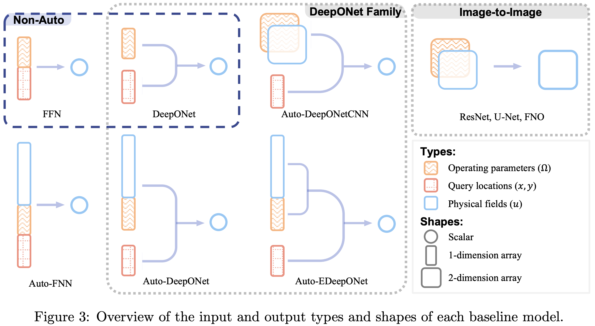
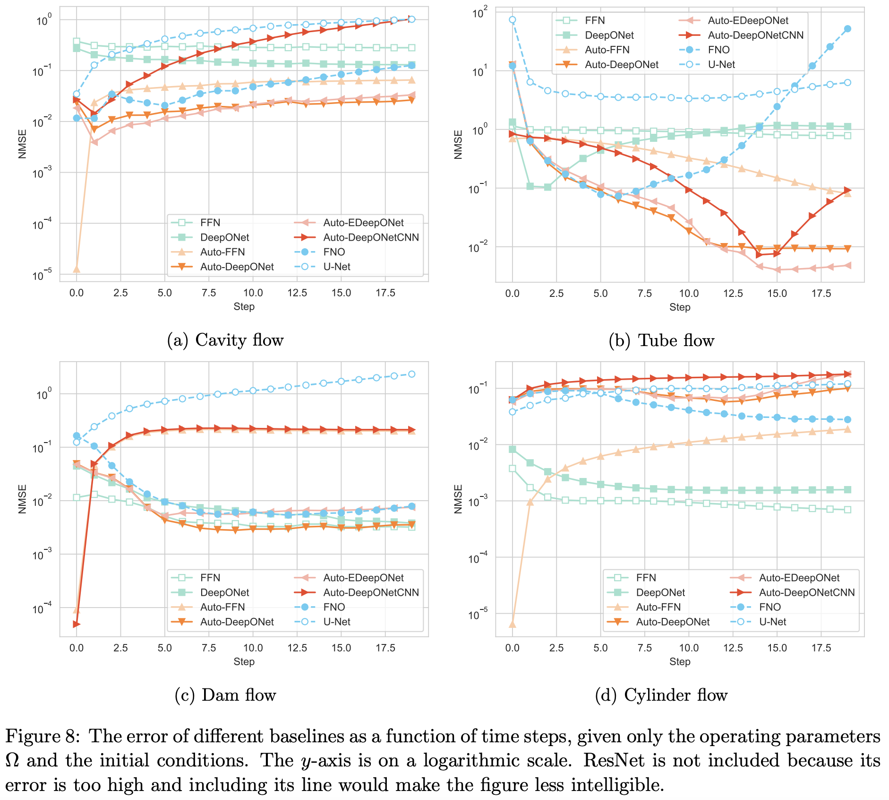

<h1 align="center">CFDBench</h1>

<div align="center">
    <a href="https://cloud.tsinghua.edu.cn/d/435413b55dea434297d1/">Data</a> | <a href="https://www.preprints.org/manuscript/202309.1550/v1">Paper (preprint)</a>
</div>

<div align="center">
    Yining Luo, Yingfa Chen, and Zhen Zhang</br>
    Tsinghua University
</div>

<div></br></div>


This is the code for the paper: [CFDBench: A Comprehensive Benchmark for Machine Learning Methods in Fluid Dynamics](https://www.preprints.org/manuscript/202309.1550/v1).

CFDBench is a large-scale and comprehensive benchmark for better evaluating machine learning methods in fluid dynamics. It consists of four classic problems in computational fluid dynamics (CFD), with many varying operating parameters such as boundary conditions, domain geometries, and physical properties.

## Data Generation

The directory `generation-code` contains the code for creating the mesh (ICEM code) and the schema code for batch generation in ANSYS Fluent.

> This part takes a lot of time, and you are better off using our generated data instead.

The raw generated data is too large for our school's cloud storage. We will send you the raw data directly upon request by email.

## Data Interpolation

After generating data with numerical algorithms, it is then interpolated to a grid of 64x64. The raw data before interpolation is very large; the link below is the interpolated data.

Main download link: [[click here]](https://cloud.tsinghua.edu.cn/d/435413b55dea434297d1/)

Contains 4 problems:

- `cavity`: Lid-driven cavity flow
- `tube`: Flow through a circular tube
- `dam`: Flow over a dam
- `cylinder`: Flow around a cylinder

> The cylinder flow is separated into three files because the file size exceeds the upload limit.

Each dataset includes 3 subsets, corresponding to changing BCs, domain geometries, and physical properties.

The directory tree for the datasets:

```
▼ cavity/
    ▼ bc/
        ▼ case0000/
            ▼ u.npy
            ▼ v.npy
        ► case0001/
    ► geo/
    ► prop/
► tube/
► dam/
► cylinder/
```

The actual data for each velocity field is stored in `u.npy` and `v.npy`.

## Models



The basic types of models are autoregressive and non-autoregressive:

- Autoregressive:
    - Auto-FFN
    - Auto-DeepONet
    - Auto-EDeepONet
    - Auto-DeepONetCNN
    - ResNet
    - U-Net
    - FNO

- Non-autoregressive
    - FFN
    - DeepONet

The implementation of the models is located in `src/models`

## Main Results

### Multi-Step Inference



### Autoregressive Models


### Nonautoregressive Models


## How to Run?

### Prepare Data

Move the data into a `data` directory next to `src` directory, such that the directory
looks like:

```
▼ data/
    ▼ cavity/
        ▼ bc/
        ▼ geo/
        ▼ prop/
    ► tube/
    ► dam/
    ► cylinder/
► generation-code/
► src/
.gitignore
README.md
```

### Training

In the `src` directory, run `train.py` or `train_auto.py` to train non-autoregressive or autoregressive models respectively. Specify the model with `--model`. For example, run FNO on the cavity flow subset with all cases:

```bash
python train_auto.py --model fno --data cavity_prop_bc_geo
```

or, run DeepONet on the dam flow PROP + GEO subset:

```bash
python train.py --model deeponet --data dam_prop_geo
```

Results will be saved to `result/` directory by default, but can be customized with the `--output_dir` argument.

For more options, such as model hyperparameters, run `python train.py -h` or `python train_auto.py -h`.

### Inference

Set `--mode test` when executing `train.py` or `train_auto.py`.

### Hardware Requirements

See the Results section in the paper. Reduce the batch size if you run out of VRAM.

## How to Add New Models/Dataset?

Our code is highly extensible and modular, and it is very easy to add new datasets or models.

### Models

To add a new model, simply create a class that inherits one of the following base models:

- `CfdModel`: If your model is nonautoregressive
- `AutoCfdModel`: If your model is autoregressive

Then depending on which base model, you have to implement just 2 or 3 methods in addition to the model architecture itself.

- Nonautoregressive: `forward`, `generate_one`.
- Autoregressive: `forward`, `generate_one`, and `generate_many`.

### Dataset

Upcoming.

## Citation

If you find this code useful, please cite our paper:

```
@article{CFDBench,
  title={CFDBench: A Comprehensive Benchmark for Machine Learning Methods in Fluid Dynamics},
  author={Yining, Luo and Yingfa, Chen and Zhen, Zhang},
  year={2023}
}
```
